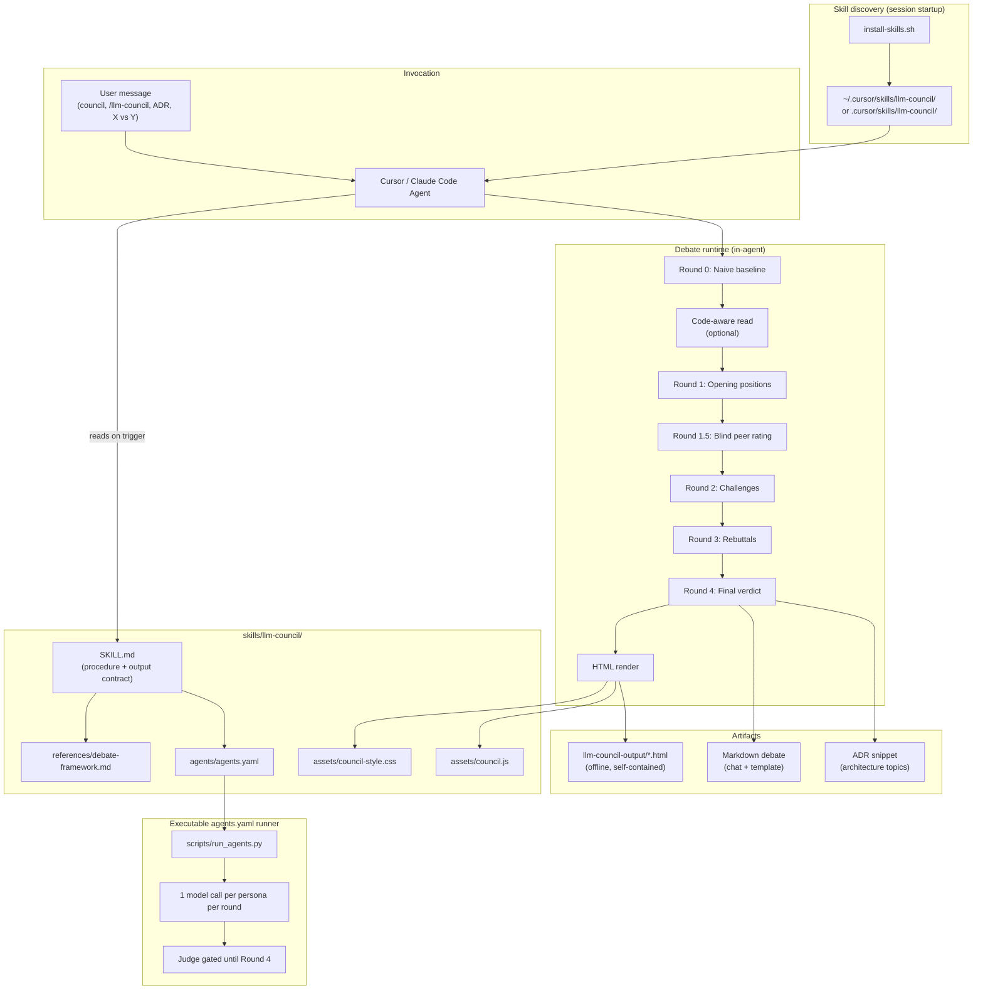
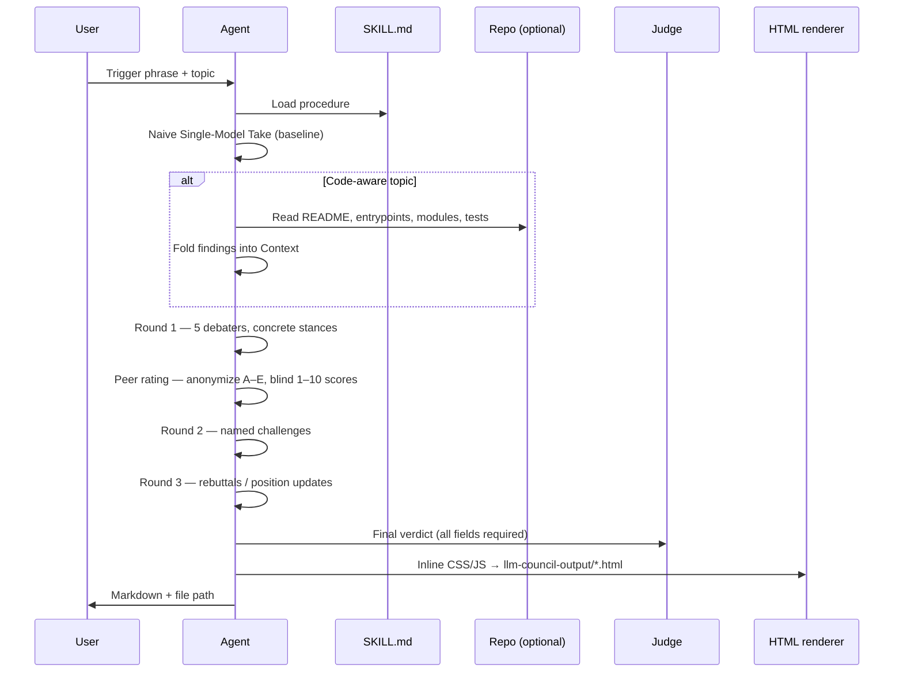

# LLM Council — Architecture & Technical Details

Reference for how the skill is structured, how a debate run flows through the agent, and what artifacts it produces.

## System overview

LLM Council is an **AI ADR/RFC decision council for engineering teams**. It can run as a procedure-driven Agent Skill inside Cursor/Claude Code, or as an executable `agents.yaml` runner from the terminal. Both paths produce **Markdown**, **validated council JSON**, an **ADR snippet**, and a **self-contained HTML file** written to disk.



## Package layout

```
skills/llm-council/
├── SKILL.md                      # Source of truth: triggers, procedure, markdown template, HTML contract
├── agents/
│   └── agents.yaml               # Portable mirror: personas, flow, validation checklist
├── references/
│   ├── debate-framework.md       # Rubric (progressive disclosure — loaded on demand)
│   └── architecture.md           # This document
└── assets/
    ├── council-style.css         # Debate page styles (inlined into HTML output)
    └── council.js                # Scroll-reveal + confidence gauge (inlined into HTML output)
```

| File | Role |
|------|------|
| `SKILL.md` | Frontmatter `name` + `description` drive auto-discovery; body defines the full procedure |
| `debate-framework.md` | Scoring anchors, anti-patterns, validation checklist — keeps `SKILL.md` lean |
| `agents.yaml` | Executable roster/flow for `scripts/run_agents.py`; must stay in sync with `SKILL.md` |
| `council-style.css` / `council.js` | Bundled into every HTML artifact; no external CDN or `<link>` at render time |

**Sync rule:** When personas, rounds, peer-rating rules, or the HTML class/`data-*` contract change, update `SKILL.md`, `agents/agents.yaml`, and `references/debate-framework.md` together.

## Debate pipeline

The terminal runner follows the same flow, but each participant is a separate model call: one naive-baseline call, five Round 1 opening calls, five blind peer-rating calls, five Round 2 challenge calls, five Round 3 rebuttal calls, and exactly one Round 4 Judge call. The Judge is never called before Round 4.



### Round contract

| Phase | Participants | Purpose |
|-------|--------------|---------|
| **0 — Naive baseline** | `naive_baseline` | Fair one-shot answer before debate; contrast anchor |
| **Setup** | Agent | Restate topic; infer criteria; code-aware Context |
| **1 — Opening** | 5 debaters | Concrete stance per persona; each ends with `Verdict:` |
| **1.5 — Peer rating** | 5 debaters | Positions shuffled to A–E; blind rigor + usefulness scores |
| **2 — Challenges** | 5 debaters | Named technical objections; no early convergence |
| **3 — Rebuttals** | 5 debaters | Defend or update; `↻` stance changes tracked |
| **4 — Final verdict** | Judge only | Committed recommendation + confidence + next 3 actions |

Every debater turn in Rounds 1–3 **must** end with a one-line `Verdict:` so the convergence grid can classify stance buckets per round.

## Persona model

Five debaters + one Judge (Judge silent until Round 4). Roster stays at five seats — swaps substitute, never add.

| ID | Persona | Lens | Temp (yaml) |
|----|---------|------|-------------|
| `first_principles_thinker` | First-Principles Thinker | Mechanism, fundamentals | 0.6 |
| `research_scientist` | Research Scientist | Evidence, theory, measurement gaps | 0.7 |
| `systems_engineer` | Systems Engineer | Scale, reliability, cost, ops | 0.6 |
| `skeptic_red_team` | Skeptic / Red Team | Failure modes, hidden costs | 0.8 |
| `product_user_advocate` | Product / User Advocate | User value, adoption | 0.7 |
| `judge_synthesizer` | Judge / Synthesizer | Synthesis only | 0.3 |

**Security council swap:** For auth, data handling, or threat-model topics, replace Product Advocate with **Security Engineer** (`persona_swaps` in `agents.yaml`).

## Inputs

| Input | Required | Default behavior |
|-------|----------|------------------|
| `topic` | Yes | Ask if missing |
| `context` | No | Agent infers from message + code-aware read |
| `decision_criteria` | No | Agent states 2–4 inferred criteria under Context |
| `output_depth` | No | `standard` (`quick` \| `standard` \| `deep`) |

## Code-aware mode

When the topic references a repo, path, or “this codebase”:

1. Read `README` → entrypoints (`cli`, `main`, server bootstrap) → core modules → tests.
2. Record under **Context**: what **exists** vs what **does not** (no DB, no queue, etc.).
3. Allow personas to attack the premise (“wrong question for this codebase”).

Fixture in this repo: [`url-shortener-fixture/`](../../../url-shortener-fixture/) — in-memory base-62 shortener for persistence/encoding debates.

## Output contract

### Markdown (required)

Fixed section order: Topic → Naive baseline → Context → Round 1 → Peer Rating → Round 2 → Round 3 → Final Verdict → ADR snippet (architecture/design topics).

Validation checklist (from `debate-framework.md`) must pass before the run is complete.

### HTML (required, automatic)

- **Path:** `llm-council-output/<topic-slug>.html`
- **Self-contained:** inline `council-style.css` in `<style>`, `council.js` in `<script>` — opens offline, shareable in PR/Slack/wiki.
- **Reference layout:** `llm-council-output/kafka-vs-rabbitmq.html`

#### HTML class / data contract

| Element | Classes / attributes | Behavior |
|---------|---------------------|----------|
| Naive baseline | `.naive`, `.naive-label`, `.naive-risk` | “Before” callout after hero |
| Personas | `.p1`–`.p5`, `.avatar` glyphs | Color + emoji per debater |
| Turns | `.turn`, `.pverdict` | Per-persona block + round verdict |
| Convergence | `.evo`, `.chip[data-stance=…]`, `.chg` | Stance grid; `↻` on bucket change |
| Peer heatmap | `.rate-table`, `td[data-score=N]`, `td.self` | Green 8–10, amber 6–7, red ≤5 |
| Ranking | `.rank`, `.bar[style="--score:N"]`, `.glow` | Bar width = score/10 |
| Confidence | `.gauge[data-confidence=N]`, `.val` | Animated arc on scroll |

Stance buckets are **topic-derived** (e.g. `postgres|redis|neither|undecided`), not hard-coded in assets.

## Install & discovery

```bash
./scripts/install-skills.sh              # Cursor, personal (~/.cursor/skills)
./scripts/install-skills.sh --target claude
./scripts/install-skills.sh --scope project   # .cursor/skills in repo
./scripts/install-skills.sh --symlink         # live edits from skills/
```

| Environment | Personal path | Project path |
|-------------|---------------|--------------|
| Cursor | `~/.cursor/skills/llm-council/` | `.cursor/skills/llm-council/` |
| Claude Code | `~/.claude/skills/llm-council/` | `.claude/skills/llm-council/` |

Skills load at **session startup** — restart the agent chat after install or edits.

## Design properties

| Property | Mechanism |
|----------|-----------|
| **Procedure, not vibes** | Numbered rounds; Judge gated to Round 4 |
| **Adversarial by default** | Manufactured disagreement Rounds 1–2; blind peer rating |
| **Progressive disclosure** | Rubric in `references/`; assets loaded only at HTML render |
| **Deterministic outputs** | Markdown template + HTML schema in `SKILL.md` |
| **Portable** | `agents.yaml` mirrors flow for non-Cursor runners |
| **No runtime deps** | No server, no API keys in the skill itself — runs entirely in the agent |

## Related paths in this repo

| Path | Purpose |
|------|---------|
| [`index.html`](../../../index.html) | Landing page |
| [`llm-council-output/`](../../../llm-council-output/) | Example debate HTML |
| [`examples/`](../../../examples/) | Structured council inputs used to reproduce demo artifacts |
| [`scripts/council_tool.py`](../../../scripts/council_tool.py) | Local renderer + validator for the output contract |
| [`scripts/run-demo.sh`](../../../scripts/run-demo.sh) | One-command demo proof path |
| [`scripts/install-skills.sh`](../../../scripts/install-skills.sh) | Install all skills |
| [`url-shortener-fixture/`](../../../url-shortener-fixture/) | Code-aware debate fixture |
